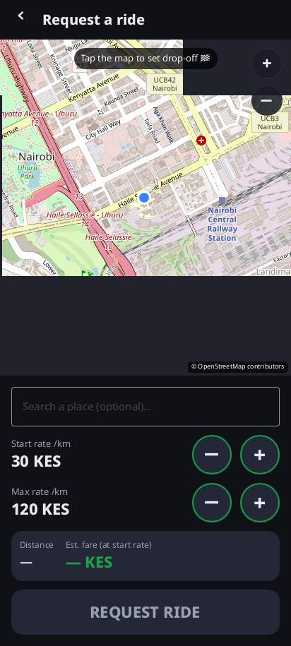

# nairobi2

A **permissionless, fully Nostr-native ridesharing app** for Android, in **Rust + [Slint](https://slint.dev)**.

No company, no server, no accounts, no platform fee — just riders and drivers meeting over the
open [Nostr](https://nostr.com) network and paying **cash, peer-to-peer**, in person.

<p align="center">
  
  
  
</p>

<p align="center"><sub>Running under a virtual display (Slint software renderer). Left→right: Home, the map-first ride request (real OpenStreetMap tiles + GPS pin + escalating-rate steppers), and the driver's nearby-rides list.</sub></p>

## How it works

1. A **passenger** posts a ride request (pickup → dropoff) with a **starting** rate per km and a
   **maximum** rate they're willing to pay. The offered rate **climbs every 30 seconds for 5
   minutes** until a driver accepts or the maximum is reached — a reverse auction in the rider's
   favour.
2. **Drivers** nearby see a live list of requests, sorted by **distance to pickup**, **total
   earnings**, **rate**, or **trip distance**, and **take** one. If several drivers take the same
   ride at once, the **first one wins**, decided deterministically with no referee.
3. Once matched, each side sees the other as a **moving dot on the map**, the driver gets a
   one-tap **Navigate** handoff to their usual maps app, and they can exchange **end-to-end
   encrypted** messages (with one-tap pictogram replies). They meet at the pin and settle in cash.

Distances and the map come from **OpenStreetMap** (Nominatim + OSRM, with OSM tiles). The UI is
Uber-like but **icon-first and numeral-based**, so it's usable by people who can't read.

> **No backend, ever.** Every interaction is a signed Nostr event over public relays. The app
> scales by scoping subscriptions with geohashes, not by adding servers.

## Wallet & M-Pesa cash-out

The app carries an optional **self-custodial Bitcoin / Lightning wallet**. It can be funded over
**Lightning** (the app shows an invoice) or **on-chain** (a deposit address), spend by paying a
Lightning invoice or sending on-chain, and — the headline feature for Kenya — **cash out to
M-Pesa**: enter a phone number and an amount, and the app pays `<phone>@bitcoin.co.ke` over
Lightning, which converts the sats to **KES** and pushes them to that M-Pesa wallet.

The wallet sits behind one small, swappable trait (`nairobi_core::wallet::Wallet`), so the same UI
and the same internal "pay this Lightning invoice" API work over any backend:

- a deterministic **`MockWallet`** (tests + desktop simulator),
- a **[Fedimint](https://fedimint.org) e-cash wallet** (`nairobi-wallet-fedimint`), funded from a
  federation, and
- — later — a **Nostr Wallet Connect** (NIP-47) link to a remote wallet, a drop-in third backend.

The LUD-16 lightning-address / LNURL-pay resolution behind the M-Pesa payout is pure and unit-tested
(no network in tests). See [`CLAUDE.md`](CLAUDE.md) for how to enable the Fedimint backend.

## Sybil resistance — proof-of-burn reputation

Anyone can mint a Nostr key for free, so an open feed invites **Sybil spam**: a flood of throwaway
identities posting fake ride requests and acceptances. nairobi2 raises the cost of that flood with
**proof-of-burn** — a publicly verifiable Bitcoin commitment that a number of satoshis was
**irreversibly sacrificed to the miners**, attached to a Nostr event. Burns are produced by a
**notary** ([`notary.electrum.org`](https://github.com/spesmilo/notary)), paid over the app's
Lightning wallet, and **verified client-side against Electrum indexing servers** — so no party is
ever trusted for proof *validity*, only for liveness. (Based on T. Voegtlin's *The Price of
Attention: Attaching Bitcoin Fees to Nostr Events*, 2025.)

It is a **client-side filter, never a gatekeeper**: a burn makes you more *visible* under each
peer's own threshold; it never grants or denies the right to ride. Reputation is layered so the
cost stays **off the ride's critical path**:

- **L1 — identity bond.** Burn once (a few hundred sats) against a stable, self-signed identity
  event. That burn *is* your baseline reputation, and every Sybil identity now costs real money.
- **L2 — proof-of-ride.** After a completed ride, each party can burn ~1 % of the fare against a
  ride-completion attestation, so reputation accrues with genuine, **counterparty-diverse** usage.
- **L3 — reputation gate.** Drivers and passengers hide or flag peers below a **self-chosen**
  minimum reputation. The expensive part already happened, so ride-time filtering is a cache
  lookup with zero added latency.
- **L3′ — newcomer boost (optional).** A fresh, weaker *mempool* burn on a single request buys
  immediate visibility before reputation exists; it can be anonymous.

A burn binds to a pubkey only when that key both **authors** the event and **signs** the burn's
leaf hash — the Nostr identity key is the same secp256k1 / BIP340 key, so there's no second
keypair. Scores sum only **confirmed, leaf-hash-deduplicated** burns, and the whole subsystem is
**off by default**, so the app stays permissionless out of the box and a market can tighten
thresholds if it wants to.

> **Still no backend.** Proof-of-burn adds no server: burns are Bitcoin transactions, proofs ride
> on Nostr (addressable kind-30021 events), and verification is your phone talking to Electrum
> indexers. A cheating notary simply produces no valid proof, and the notary is a swappable
> interface.

See the [proof-of-burn design spec](docs/superpowers/specs/2026-06-18-proof-of-burn-antisybil-design.md)
and the [protocol notes](docs/proof-of-burn-api.md) for the full scheme.

## Status

- **Core logic — complete and tested.** The entire ride engine (identity, geocoding/routing,
  the escalating auction, deterministic first-taker-wins, the Nostr protocol, the relay transport,
  the full ride lifecycle, the modular wallet + LUD-16/M-Pesa payout logic, and the proof-of-burn
  anti-Sybil layer — leaf/Merkle-sum hashing, Bitcoin tx/script parsing, client-side proof
  verification, and the bond → proof → reputation → gating lifecycle) lives in the `nairobi-core`
  crate and passes **136 unit tests**.
- **App + Android shell + build pipeline — building.** `./build.sh` compiles the Slint UI,
  cross-compiles for `aarch64-linux-android` (Skia + android-activity + nostr-sdk), and packages a
  valid, signed **18 MB `dist/nairobi-debug.apk`** (`io.nairobi.app`, minSdk 26). Following the
  proven [ntrack](https://github.com/f321x/ntrack) structure. The desktop build also runs (under a
  virtual display): the Home screen renders (above) and the app connects to live relays
  (`nos.lol`, `relay.damus.io`, `relay.primal.net`). *Full on-hardware behaviour and the live
  end-to-end ride flow remain to be exercised on a device.*

**Sybil resistance** is now addressed by the proof-of-burn layer above: the core (hashing, tx
parsing, verification, and reputation) is complete and host-tested against mocks, and the app
wires the real notary + Electrum + wallet path. Gating and the per-ride burn are config-driven and
**default off**, the live notary/Electrum/Lightning path is not yet exercised on a device, and a
Settings action to trigger the identity bond is the remaining piece.

This is a **v1 / proof of concept**. Still out of scope for now (by design): ratings and reputation
beyond burns, a pre-request "drivers nearby" map, and key backup. See the design spec.

## Build

Core tests run on the host with Cargo; the APK builds in a rootless-friendly container (Docker or
Podman — no other host tooling needed).

```sh
# Core logic (fast, host)
cargo test -p nairobi-core
cargo clippy -p nairobi-core --all-targets -- -D warnings

# Android APK (containerised; builds the toolchain image on first run)
./build.sh                       # -> dist/nairobi-debug.apk
adb install -r dist/nairobi-debug.apk
```

See [`CLAUDE.md`](CLAUDE.md) for the architecture and developer notes, and
[`docs/superpowers/specs/`](docs/superpowers/specs/) for the full design.

## License

MIT
