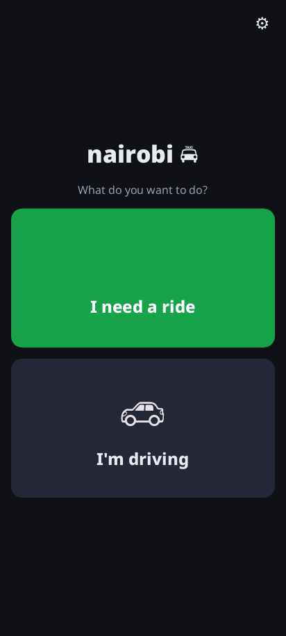

# nairobi2

A **permissionless, fully Nostr-native ridesharing app** for Android, in **Rust + [Slint](https://slint.dev)**.

No company, no server, no accounts, no platform fee — just riders and drivers meeting over the
open [Nostr](https://nostr.com) network and paying **cash, peer-to-peer**, in person.

<p align="center"></p>

## How it works

1. A **passenger** posts a ride request (pickup → dropoff) with a **starting** rate per km and a
   **maximum** rate they're willing to pay. The offered rate **climbs every 30 seconds for 5
   minutes** until a driver accepts or the maximum is reached — a reverse auction in the rider's
   favour.
2. **Drivers** nearby see a live list of requests, sorted by **distance to pickup**, **total
   earnings**, **rate**, or **trip distance**, and **take** one. If several drivers take the same
   ride at once, the **first one wins**, decided deterministically with no referee.
3. Once matched, each side sees the other as a **moving dot on the map**, the driver gets a
   one-tap **Navigate** handoff to their usual maps app, and they can exchange **end-to-end
   encrypted** messages (with one-tap pictogram replies). They meet at the pin and settle in cash.

Distances and the map come from **OpenStreetMap** (Nominatim + OSRM, with OSM tiles). The UI is
Uber-like but **icon-first and numeral-based**, so it's usable by people who can't read.

> **No backend, ever.** Every interaction is a signed Nostr event over public relays. The app
> scales by scoping subscriptions with geohashes, not by adding servers.

## Status

- **Core logic — complete and tested.** The entire ride engine (identity, geocoding/routing,
  the escalating auction, deterministic first-taker-wins, the Nostr protocol, the relay transport,
  and the full ride lifecycle) lives in the `nairobi-core` crate and passes **78 unit tests**.
- **App + Android shell + build pipeline — building.** `./build.sh` compiles the Slint UI,
  cross-compiles for `aarch64-linux-android` (Skia + android-activity + nostr-sdk), and packages a
  valid, signed **18 MB `dist/nairobi-debug.apk`** (`io.nairobi.app`, minSdk 26). Following the
  proven [ntrack](https://github.com/f321x/ntrack) structure. The desktop build also runs (under a
  virtual display): the Home screen renders (above) and the app connects to live relays
  (`nos.lol`, `relay.damus.io`, `relay.primal.net`). *Full on-hardware behaviour and the live
  end-to-end ride flow remain to be exercised on a device.*

This is a **v1 / proof of concept**. Out of scope for now (by design): sybil resistance, ratings
and reputation, a pre-request "drivers nearby" map, and key backup. See the design spec.

## Build

Core tests run on the host with Cargo; the APK builds in a rootless-friendly container (Docker or
Podman — no other host tooling needed).

```sh
# Core logic (fast, host)
cargo test -p nairobi-core
cargo clippy -p nairobi-core --all-targets -- -D warnings

# Android APK (containerised; builds the toolchain image on first run)
./build.sh                       # -> dist/nairobi-debug.apk
adb install -r dist/nairobi-debug.apk
```

See [`CLAUDE.md`](CLAUDE.md) for the architecture and developer notes, and
[`docs/superpowers/specs/`](docs/superpowers/specs/) for the full design.

## License

MIT
